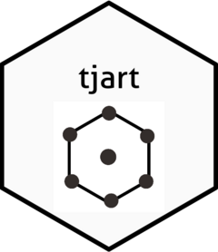

<!-- README.md is generated from README.Rmd. Please edit that file -->

# tjart 

<!-- badges: start -->

[](https://codecov.io/gh/tjpalanca/tjart?branch=master)
[](https://github.com/tjpalanca/tjart/actions)

[](https://creativecommons.org/licenses/by/4.0/)
<!-- badges: end -->

## Installation

This package is available from my [R
Universe](https://tjpalanca.r-universe.dev).

``` r
install.packages("tjart", repos = "https://tjpalanca.r-universe.dev")
```
